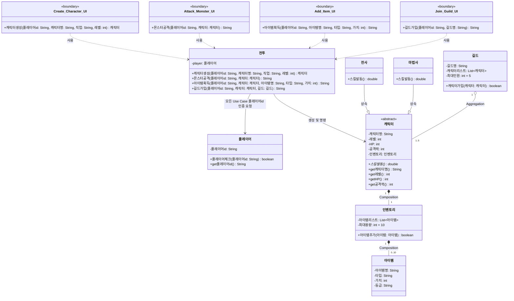

```mermaid
classDiagram
    class Create_Character_UI {
        <<boundary>>
        +캐릭터생성(플레이어id: String, 캐릭터명: String, 직업: String, 레벨: int) 캐릭터
    }
    class Attack_Monster_UI {
        <<boundary>>
        +몬스터공격(플레이어id: String, 캐릭터: 캐릭터) String
    }
    class Add_Item_UI {
        <<boundary>>
        +아이템획득(플레이어id: String, 아이템명: String, 타입: String, 가치: int) String
    }
    class Join_Guild_UI {
        <<boundary>>
        +길드가입(플레이어id: String, 길드명: String) String
    }

    class 전투 {
        -player: 플레이어
        +캐릭터생성(플레이어id: String, 캐릭터명: String, 직업: String, 레벨: int) 캐릭터
        +몬스터공격(플레이어id: String, 캐릭터: 캐릭터) String
        +아이템획득(플레이어id: String, 캐릭터: 캐릭터, 아이템명: String, 타입: String, 가치: int) String
        +길드가입(플레이어id: String, 캐릭터: 캐릭터, 길드: 길드) String
    }

    class 플레이어 {
        -플레이어id: String
        +플레이어체크(플레이어id: String) boolean
        +get플레이어id() String
    }

    class 캐릭터 {
        <<abstract>>
        -캐릭터명: String
        -레벨: int
        -HP: int
        -공격력: int
        -인벤토리: 인벤토리
        +스킬발동()* double
        +get캐릭터명() String
        +get레벨() int
        +getHP() int
        +get공격력() int
    }

    class 전사 {
        +스킬발동() double
    }

    class 마법사 {
        +스킬발동() double
    }

    class 인벤토리 {
        -아이템리스트: List~아이템~
        -최대용량: int = 10
        +아이템추가(아이템: 아이템) boolean
    }

    class 아이템 {
        -아이템명: String
        -타입: String
        -가치: int
        -등급: String
    }

    class 길드 {
        -길드명: String
        -캐릭터리스트: List~캐릭터~
        -최대인원: int = 5
        +캐릭터가입(캐릭터: 캐릭터) boolean
    }

    Create_Character_UI ..> 전투 : 사용
    Attack_Monster_UI ..> 전투 : 사용
    Add_Item_UI ..> 전투 : 사용
    Join_Guild_UI ..> 전투 : 사용
    전투 --> 플레이어 : 모든 Use Case 플레이어id 인증 요청
    전투 --> 캐릭터 : 생성 및 명령
    전사 --|> 캐릭터 : 상속
    마법사 --|> 캐릭터 : 상속
    캐릭터 "1" *-- "1" 인벤토리 : Composition
    인벤토리 "1" *-- "0..10" 아이템 : Composition
    길드 "1" o-- "1..5" 캐릭터 : Aggregation
```
