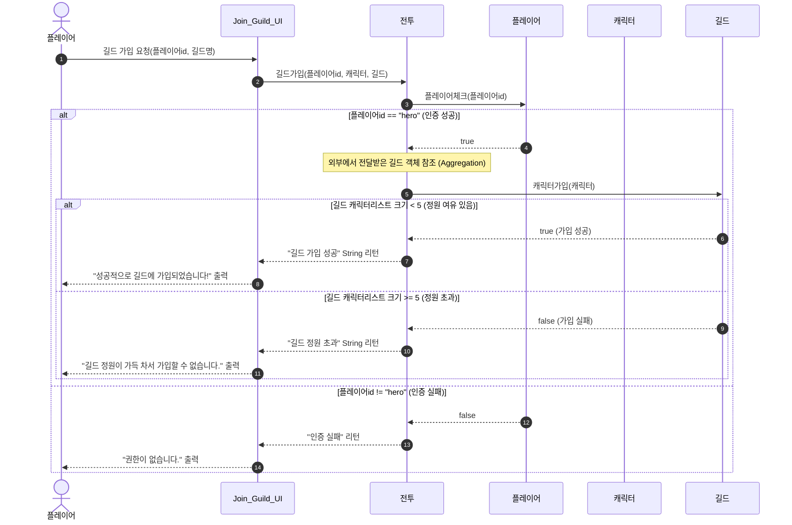

```mermaid
sequenceDiagram
    autonumber
    actor Player as 플레이어
    participant UI as Join_Guild_UI
    participant Ctrl as 전투
    participant PClass as 플레이어
    participant Char as 캐릭터
    participant Guild as 길드

    Player ->> UI: 길드 가입 요청(플레이어id, 길드명)
    UI ->> Ctrl: 길드가입(플레이어id, 캐릭터, 길드)
    Ctrl ->> PClass: 플레이어체크(플레이어id)

    alt 플레이어id == "hero" (인증 성공)
        PClass -->> Ctrl: true

        Note over Ctrl: 외부에서 전달받은 길드 객체 참조 (Aggregation)
        Ctrl ->> Guild: 캐릭터가입(캐릭터)

        alt 길드 캐릭터리스트 크기 < 5 (정원 여유 있음)
            Guild -->> Ctrl: true (가입 성공)
            Ctrl -->> UI: "길드 가입 성공" String 리턴
            UI -->> Player: "성공적으로 길드에 가입되었습니다!" 출력
        else 길드 캐릭터리스트 크기 >= 5 (정원 초과)
            Guild -->> Ctrl: false (가입 실패)
            Ctrl -->> UI: "길드 정원 초과" String 리턴
            UI -->> Player: "길드 정원이 가득 차서 가입할 수 없습니다." 출력
        end

    else 플레이어id != "hero" (인증 실패)
        PClass -->> Ctrl: false
        Ctrl -->> UI: "인증 실패" 리턴
        UI -->> Player: "권한이 없습니다." 출력
    end
```
