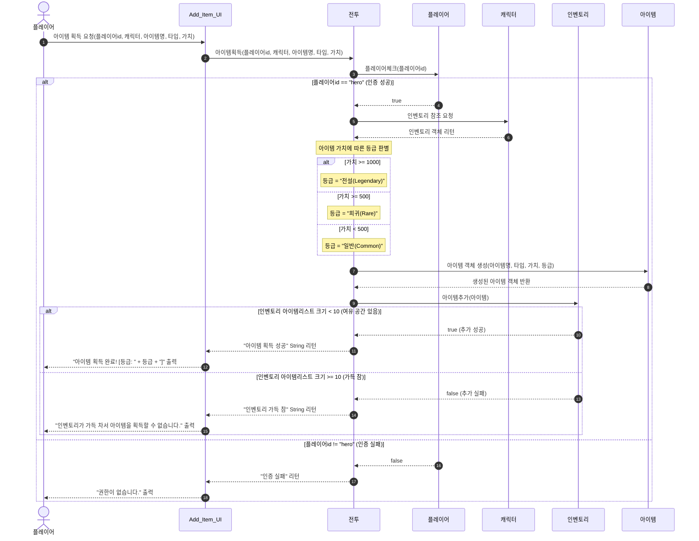

```mermaid
sequenceDiagram
    autonumber
    actor Player as 플레이어
    participant UI as Add_Item_UI
    participant Ctrl as 전투
    participant PClass as 플레이어
    participant Char as 캐릭터
    participant Inv as 인벤토리
    participant Item as 아이템

    Player ->> UI: 아이템 획득 요청(플레이어id, 캐릭터, 아이템명, 타입, 가치)
    UI ->> Ctrl: 아이템획득(플레이어id, 캐릭터, 아이템명, 타입, 가치)
    Ctrl ->> PClass: 플레이어체크(플레이어id)

    alt 플레이어id == "hero" (인증 성공)
        PClass -->> Ctrl: true
        Ctrl ->> Char: 인벤토리 참조 요청
        Char -->> Ctrl: 인벤토리 객체 리턴

        Note over Ctrl: 아이템 가치에 따른 등급 판별
        alt 가치 >= 1000
            Note over Ctrl: 등급 = "전설(Legendary)"
        else 가치 >= 500
            Note over Ctrl: 등급 = "희귀(Rare)"
        else 가치 < 500
            Note over Ctrl: 등급 = "일반(Common)"
        end

        Ctrl ->> Item: 아이템 객체 생성(아이템명, 타입, 가치, 등급)
        Item -->> Ctrl: 생성된 아이템 객체 반환

        Ctrl ->> Inv: 아이템추가(아이템)

        alt 인벤토리 아이템리스트 크기 < 10 (여유 공간 있음)
            Inv -->> Ctrl: true (추가 성공)
            Ctrl -->> UI: "아이템 획득 성공" String 리턴
            UI -->> Player: "아이템 획득 완료! [등급: " + 등급 + "]" 출력
        else 인벤토리 아이템리스트 크기 >= 10 (가득 참)
            Inv -->> Ctrl: false (추가 실패)
            Ctrl -->> UI: "인벤토리 가득 참" String 리턴
            UI -->> Player: "인벤토리가 가득 차서 아이템을 획득할 수 없습니다." 출력
        end

    else 플레이어id != "hero" (인증 실패)
        PClass -->> Ctrl: false
        Ctrl -->> UI: "인증 실패" 리턴
        UI -->> Player: "권한이 없습니다." 출력
    end
```
